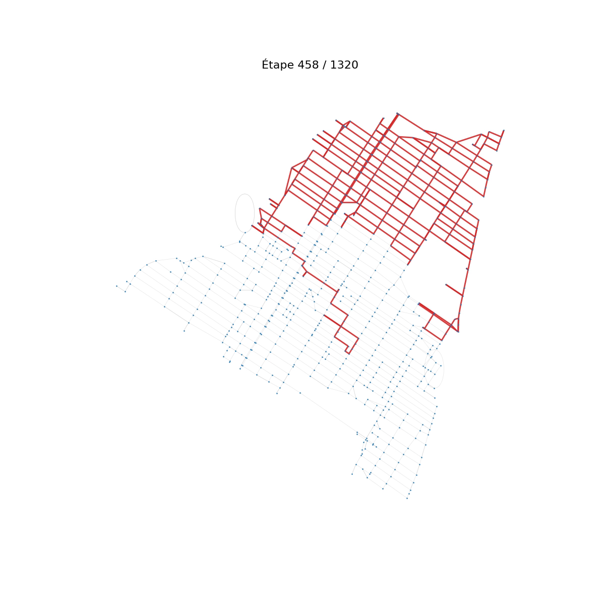
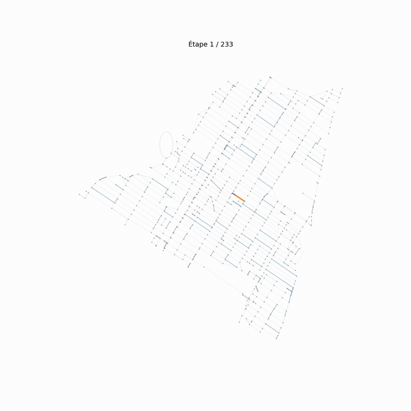
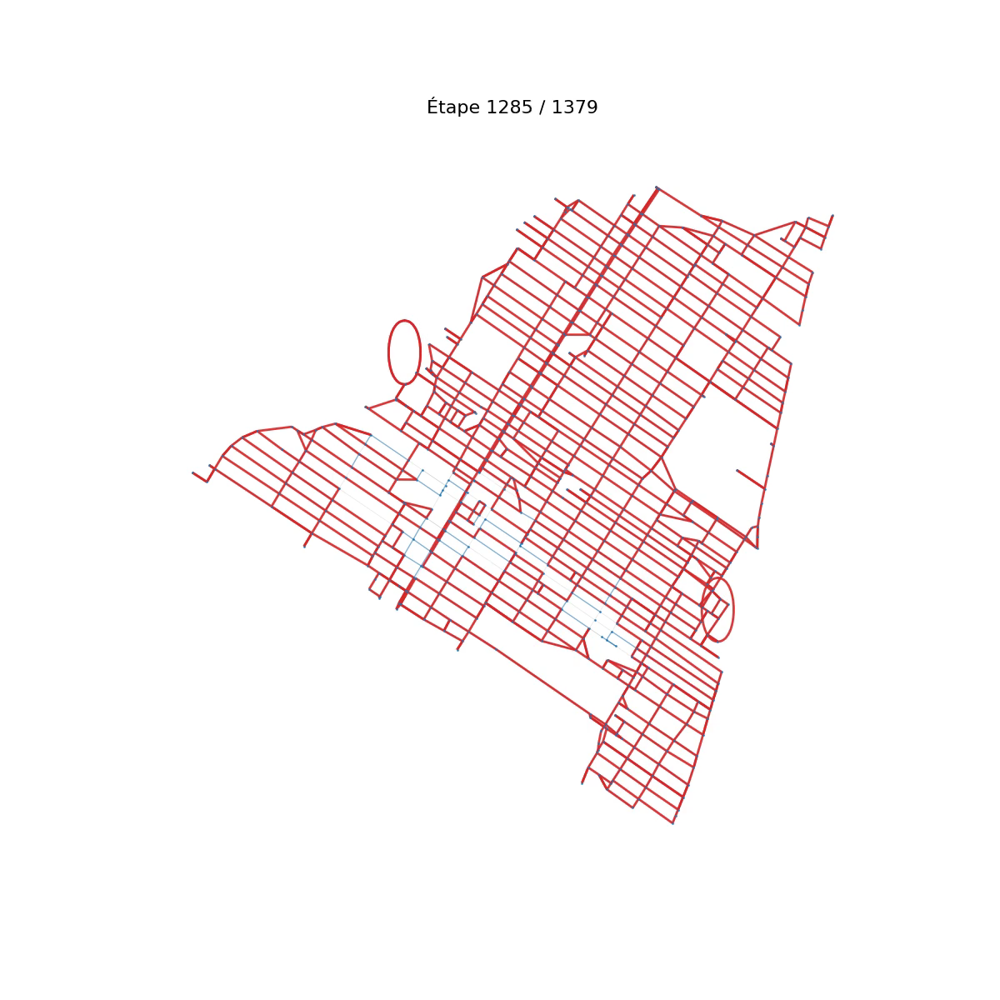

# Snow Clearing Optimizer (Montréal, ERO1)

Route optimization project that plans how to clear snow from the streets of
Montréal as fast and as cheaply as possible. The city is modeled as a road
graph extracted from OpenStreetMap, and two fleets are simulated:

- A drone that flies over every street to survey snow accumulation. This
  reconnaissance pass is modeled as an Eulerian circuit over the whole graph.
- Snow plows that physically clear the snowed-in streets, planned with a route
  optimization strategy built on top of Floyd-Warshall shortest paths.

The simulator compares several operational scenarios (number of plows, plow
type, starting points) and reports the total distance, clearing time, and
operating cost for each.

## Screenshots

### Drone reconnaissance: Eulerian circuit over Montréal
The drone traverses every road of the city. Streets already flown over are
drawn in red.



### Four snow plows clearing the Plateau-Mont-Royal (animated)
The neighborhood is split into four zones (using a geographic center and the
four extreme points of the map), and one plow is assigned to each. Each color
is a different plow, clearing its zone step by step.



### Single snow plow, full route
A single plow clears the whole neighborhood by repeatedly heading to the
nearest snowed-in street via its shortest path.



## How it works

### The drone (reconnaissance)
The whole road network must be flown over at least once. Because a road graph
is generally not Eulerian, each neighborhood graph is first eulerized
(precomputed graphs are stored in `database/eulerized_maps/`), after which an
Eulerian circuit visits every edge and returns to the start. The traveled
distance gives the drone's flight cost.

### The snow plows (clearing)
Only the streets reported as snowed-in need clearing. Starting from a chosen
point, a plow repeatedly:

1. Looks up the shortest path to every remaining snowed-in street using
   Floyd-Warshall distances (precomputed and cached in
   `database/floyd_warshall_data/`).
2. Drives to the nearest accessible snowed-in street and clears it.
3. Repeats until none remain.

Several strategies are compared:

- One plow clearing the entire neighborhood.
- Four plows starting from the center, each responsible for one zone obtained
  by splitting the streets toward the four extreme points of the map.

Two plow models are simulated, each with its own speed and cost structure:

| Type | Speed   | Cost per km | Fixed cost |
|------|---------|-------------|------------|
| I    | 10 km/h | 1.1 €/km    | 500 €      |
| II   | 20 km/h | 1.3 €/km    | 800 €      |

Hours worked beyond 8 in a shift incur an overtime surcharge. For each scenario
the simulator prints the fastest, the fewest-plows, and the most economical
option.

## Project structure

```
.
├── ero1.py                  # Batch simulation of the snow-plow scenarios
├── ERO1.ipynb               # Synthesis notebook: runs simulations and animations
├── database/
│   ├── maps/                # Road graphs of each neighborhood and all of Montréal
│   ├── eulerized_maps/      # Eulerized versions of the graphs (for the drone)
│   ├── floyd_warshall_data/ # Cached Floyd-Warshall results per neighborhood
│   ├── get_and_save.py      # Download a neighborhood graph from OpenStreetMap
│   └── load.py              # Inspect a saved graph (nodes, edges, connectivity)
├── drone/                   # Notebooks exploring the drone routing approaches
├── deneigeuses/             # Notebooks exploring the snow-plow approaches
├── animations/              # Rendered MP4 animations of the routes
└── docs/screenshots/        # Still frames used in this README
```

Available neighborhoods: Anjou, Outremont, Plateau-Mont-Royal,
Rivière-des-Prairies-Pointe-aux-Trembles, and Verdun, plus the full city of
Montréal.

## Installation

```bash
./install.sh
```

This installs the dependencies: `networkx`, `matplotlib`, `osmnx`, `numpy`,
`scikit-learn`, `ipython`, and `jupyterlab`.

## Usage

### Run the scenario simulation

```bash
python3 ero1.py
```

You are prompted to choose a neighborhood; the program then reports the drone
cost and the snow-plow scenarios (distance, clearing time, and cost).

### Explore the animations

```bash
jupyter lab
```

Open `ERO1.ipynb` and run all cells (optionally change the neighborhood name in
the last cell) to regenerate the route animations.

## Authors

- Arthur Pauchey
- Élie Dalmas
- Éric Hennebert
- Quentin Lauret
